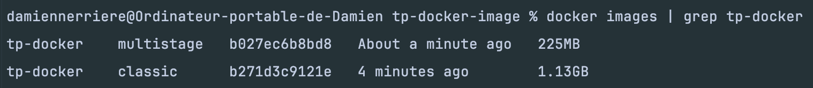

2.1 : 
2.2 : les dépendances

3.1 : 
en supprimant les modules et les logs on obtient un gain de 0.9Go
3.2 : les devDependencies
3.3 : Oui moin de chose installé donc moins de matière d'attaque

4.1: RUN /bin/sh -c npm run build 
4.2 docker utilise des couches si un fichier ne change pas alors il utilise le cache du ci
